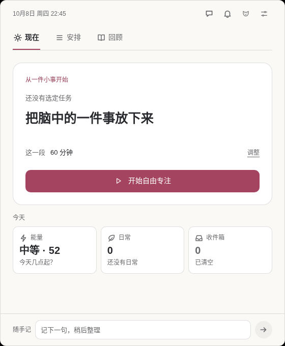
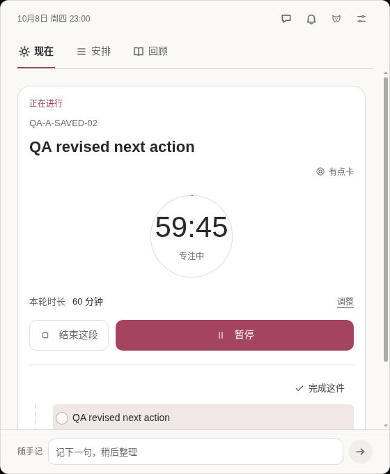
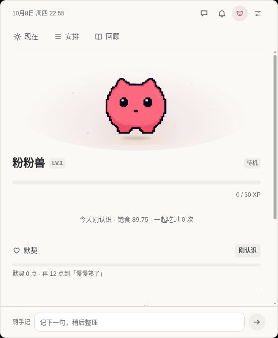

# bubu · 小步

**A small next step. A visible timer. A companion for coming back.**

bubu (小步) is a local-first desktop app for ADHD-friendly everyday productivity. Capture a thought, choose one next action, start a focus session, and return after an interruption. Built with Electron, with an optional desktop companion and optional AI assistance.

[Project website](https://jemicyzhu-0333.github.io/bubu/) · [简体中文](README.zh-CN.md) · [Downloads & builds](#downloads--builds) · [Get started](#run-from-source) · [Documentation](#documentation)

The current testing preview is [`0.0.2-dev.3`](https://github.com/jemicyzhu-0333/bubu/releases/tag/v0.0.2-dev.3). It is an executive-function support tool, not a medical device, and does not diagnose, treat, or promise clinical benefits for ADHD. General settings offer Simplified Chinese / English preview and System / Light / Dark appearance.

## A look inside

These are unaltered, app-only captures from native Electron testing on Linux, using disposable test data. Test task names are fictional. They were captured before the bubu rename and show actual UI states, not mockups or proof of Windows/macOS validation. The characters retain their separate [rights restrictions](#license--artwork).

| Now: one place to begin | Focus: the next action and remaining time |
| --- | --- |
|  |  |

| Your companion | On the desktop |
| --- | --- |
|  |  |

## What you can do

- **Capture first, organize later.** Keep a quick-capture box close by; sort the inbox into tasks, routines, state notes, private emotion records, or saved ideas.
- **Make the next step clear.** Create a task with just a title, then add steps, dates, recurrence, tags, or time estimates as needed. Local suggestions offer both overall priority and an easier place to start.
- **Focus, pause, and come back.** Use a focus timer, take a break, or try a two-minute start. Leave a “next time, start here” step. Sessions that expire while the app is offline need your confirmation before they count.
- **Keep everyday life separate from work.** Set routine reminders, record what happened, and review your timeline and progress. Missed days do not erase progress; there are no streak penalties. Energy estimates are everyday planning aids, not medical measurements.
- **Have a desktop companion nearby.** Interact with Dango and Usagi forms, feed them, spend food tickets on food, and choose available outfits. Do Not Disturb, reduced motion, and low-stimulation settings are separate controls.
- **Use AI only if you want it.** Bring your own OpenAI-compatible provider for task breakdown, next-step suggestions, and ongoing collaboration. Choose the reference context, inspect proposed changes, and confirm before applying them. Core features work without AI.

The main panel has **Now / Plan / Review** sections (现在 / 安排 / 回顾). Plan includes tasks, routines, inbox, and archives. The app lives in the system tray or menu bar.

## Downloads & builds

- **Project website:** visit the [project page](https://jemicyzhu-0333.github.io/bubu/) for an overview and current download notices.
- **Current testing preview: [`v0.0.2-dev.3`](https://github.com/jemicyzhu-0333/bubu/releases/tag/v0.0.2-dev.3).** App/package version: `0.0.2-dev.3`. It clears finished AI-tool activity promptly, improves the task calendar, removes the unused inbox quick-start area, and lets quick capture grow with your text. Mac development startup also prepares its native music-detection helper; real NetEase playback detection remains unverified.
- **Verified downloads:** [Windows x64 · unsigned](https://github.com/jemicyzhu-0333/bubu/releases/download/v0.0.2-dev.3/bubu-0.0.2-dev.3-win-x64.exe) · [macOS Apple Silicon · ad-hoc restricted test](https://github.com/jemicyzhu-0333/bubu/releases/download/v0.0.2-dev.3/bubu-0.0.2-dev.3-mac-arm64-adhoc-test.dmg) · [SHA256SUMS.txt](https://github.com/jemicyzhu-0333/bubu/releases/download/v0.0.2-dev.3/SHA256SUMS.txt). Public downloads were checked against the original installer sizes and SHA-256 hashes; see the release notes for exact filenames and hashes.
- **Earlier previews:** [v0.0.2-dev.2](https://github.com/jemicyzhu-0333/bubu/releases/tag/v0.0.2-dev.2) ([evidence](docs/VALIDATION.md#002-dev2-已发布测试包的证据边界)) and [v0.0.2-dev.1](https://github.com/jemicyzhu-0333/bubu/releases/tag/v0.0.2-dev.1) ([evidence](docs/VALIDATION.md#002-dev1-已发布测试包的证据边界)) remain available for history.
- **Previous test packages:** [v0.0.1-dev-r4](https://github.com/jemicyzhu-0333/bubu/releases/tag/v0.0.1-dev-r4) came from commit `df3242a`, with app version `0.0.1-dev`. The Windows r4 installer has a confirmed first-launch profile-admission failure; use it only as a historical diagnostic baseline. Its names and historical validation evidence remain unchanged.
- **Earlier releases:** [r3](https://github.com/jemicyzhu-0333/bubu/releases/tag/v0.0.1-dev-r3), [r2](https://github.com/jemicyzhu-0333/bubu/releases/tag/v0.0.1-dev-r2) and [v0.0.1-dev](https://github.com/jemicyzhu-0333/bubu/releases/tag/v0.0.1-dev) are retained for history. Do not install the initial v0.0.1-dev Mac package, which was reported as damaged.
- **New test builds:** the manual [Build Windows and macOS (test) workflow](https://github.com/jemicyzhu-0333/bubu/actions/workflows/build-desktop.yml) targets **Windows x64** and **macOS ARM64**. Download a successful run's artifacts while retained; GitHub may require sign-in. Check the run's branch and commit. The workflow does not create a Release.

Windows test builds are **unsigned**; SmartScreen may warn or block installation. The current Mac test build uses **ad-hoc signing**, without an Apple Developer ID or notarization. Strict signature integrity, bundle identity, direct startup of a DMG-installed copy, and SQLite persistence passed CI, but **Gatekeeper's local distribution assessment rejects this build**. Browser-download/Finder acceptance was not tested. No quarantine attribute was added or removed during validation. Do not disable operating-system security protections or remove quarantine to install it.

Both published installers passed native installation/startup and persistence checks. See [validation scope and remaining limitations](docs/VALIDATION.md#002-dev3-已发布测试包的证据边界) and the [release notes](https://github.com/jemicyzhu-0333/bubu/releases/tag/v0.0.2-dev.3) for the exact source, original build provenance and test limits.

The Mac app remains `小步.app`. The earlier rename introduced the bubu application/profile/credential identity; `0.0.2-dev.3` keeps that same identity. Older pre-bubu apps, directories and credentials remain untouched and are not imported. Existing valid bubu18 data uses the explicit backed-up upgrade below. A changed ad-hoc-signed binary may still trigger a macOS Keychain prompt.

This is a development test version, not a stable release. **In-app updates are not currently available**; the separate testing-updates feature is not included, and no in-app update channel is published. Install and update published test builds manually. Use disposable profiles for validation; an existing valid bubu18 profile is never silently reset. Linux has limited native testing and known rendering issues; see [validation and limitations](docs/VALIDATION.md).

## Run from source

Requirements: **Node.js 22.12.0+**, npm, and a desktop environment capable of running Electron. Install the full dependencies, including devDependencies.

```bash
git clone https://github.com/jemicyzhu-0333/bubu.git
cd bubu
npm ci
npm run dev
```

`npm run dev` uses the isolated `bubu-dev` development profile. `npm start` uses the `bubu` everyday profile. Their data, credentials, and Chromium storage are separate. An explicit `--user-data-dir` remains respected; only a separately confirmed, fully validated bubu18 upgrade may change its payload version.

`0.0.2-dev.3` uses canonical **schema 19** with a **bubu-branded configuration identity**. An existing, fully valid bubu schema18 profile has one explicit upgrade path: the startup dialog asks before making a complete private backup and adding the two preferences. Cancel quits without upgrading. Old-brand, unmarked, damaged, orphaned and unsupported profiles are still refused; they are never imported, reset or replaced.

The upgrade retains the original authority and credential identity. Its private sibling backup contains all ordinary profile files, including committed WAL data and opaque credential files; keep it private. Only the three top-level Electron runtime locks are omitted. A symlink, unsupported member, failed privacy check, quota error, file larger than 64 MiB, total above 512 MiB or more than 10,000 members stops the upgrade. Versions that only support schema18 cannot open schema19. To extract a verified backup offline into a **new, nonexistent** directory (never over the live profile), close bubu and run:

```bash
node scripts/extract-profile-upgrade-backup.js --backup /absolute/profile-backup.sqlite --new-directory /absolute/new-profile
```

The tool verifies the backup, preserves file contents and authority binding, and does not automatically roll back or switch the live profile. See [persistence and upgrade rules](docs/ARCHITECTURE.md#持久化与迁移) for failure/recovery limits.

Both published installers passed instrumented upgrade/private-backup checks and a separate reopen of the upgraded profile. Manual dialog interaction/accessibility, native automatic relaunch, real credentials and OS trust-warning acceptance remain unproven; see the [native validation details](docs/VALIDATION.md#002-dev3-已发布测试包的证据边界).

```bash
npm run check               # Unit, syntax, architecture, and generated-resource checks
npm run test:integration
npm run dev:bench -- --scenario=level-up  # Disposable test scenario
npm run test:electron       # Requires a usable native desktop
```

These are validation commands, not a claim that every platform has passed them. See [ARCHITECTURE](docs/ARCHITECTURE.md) for data contracts and [VALIDATION](docs/VALIDATION.md) for native checks and known limitations.

### AI setup & privacy

AI is **off by default**. To use it, enable AI in Settings, provide a public HTTPS OpenAI-compatible Base URL, model name, and API key, then save the configuration. Keys are stored using Electron's `safeStorage`; protection depends on the operating system and its credential backend. Saving fails when Electron reports encryption unavailable. The development profile needs its own configuration.

**Test Connection** checks the current inputs without saving them or enabling AI. It sends a short fixed prompt to the configured provider, without task or conversation content; the provider may charge for the request. You can cancel the test.

Local-first means the core data and workflow stay on your machine; it does not mean the app never connects to the network. When you use AI, your messages and the context assembled for that request are sent to the configured provider. Review the reference scope and your provider's data policy before sending sensitive information. No working in-app update channel is currently published. Optional activity mirroring is off by default and uses local activity categories, not desktop contents, music contents, or AI conversation text.

### Build an installer

```bash
npm run build                  # Installer for the current OS and Node architecture
npm run pack                   # Unpacked app for the current OS
npm run build:win -- --x64
npm run build:mac -- --arm64    # Run on macOS
npm run build:linux
```

`pack:win`, `pack:mac`, and `pack:linux` are also available. Build entry points support x64/arm64; that does not imply every OS/architecture combination has passed native validation. macOS requires Xcode Command Line Tools. Build scripts do not publish automatically, and Windows cannot directly build a macOS package.

## Keyboard shortcuts

| Shortcut | Action |
| --- | --- |
| `Alt/Option + Space` | Open the main panel |
| `Alt/Option + Shift + Space` | Open the quick-action panel |
| `Alt/Option + Shift + N` | Focus a visible reminder |
| `/` in the main panel | Quick capture |
| `Esc` | Close the current overlay |

If a shortcut is taken, the app tries another combination. Settings shows the actual bindings.

## Documentation

The detailed product and engineering documents are currently in Chinese. Each document owns one set of rules; the README covers features and setup.

- [Product principles](docs/PRODUCT.md): feature semantics and the shared [UI/UX rules](docs/PRODUCT.md#界面语言)
- [Architecture](docs/ARCHITECTURE.md): the [project structure and ownership map](docs/ARCHITECTURE.md#分层与能力), IPC, SQLite, and AI safety
- [Validation](docs/VALIDATION.md): automated checks, native acceptance, and known limitations
- [Pet visuals](docs/PET_VISUAL.md) and [layered rig](docs/PET_RIG.md): production geometry, layers, and asset construction
- [AGENTS.md](AGENTS.md): repository rules for coding agents

For asset work, use `npm run rig:check`, `npm run rig:build`, `npm run rig:preview`, `npm run raster:check`, and `npm run usagi:wardrobe-check`. `npm run frames` checks rendered frames; offscreen output does not replace native desktop testing.

The public repository includes generated runtime assets, source-specs, and runtime-resource checks. Complete Dango/Usagi design-master reconstruction, historical action-approval evidence, and original run-sample reconstruction remain in the original author's private archive and are outside this repository's reproducibility scope. Normal app development and installer builds do not depend on those master workflows.

## License & artwork

Project code that its contributors have the right to license is available under [PolyForm Noncommercial 1.0.0](LICENSE). This is **source-available software with noncommercial restrictions**, not OSI-approved open source. See [LICENSE-SCOPE.md](LICENSE-SCOPE.md) for the full scope; internal business use is not automatically allowed just because no copy is sold.

Third-party dependencies, characters, and artwork retain their own licenses and rights restrictions. **Usagi materials are not relicensed by this project.** Their inclusion does not establish permission from the rightsholders, and noncommercial distribution alone does not establish permission. Retain the [Usagi usage notice](assets/companion/usagi/USAGE.txt). Dango artwork rights likewise cannot be inferred from the code license; check the applicable sources and permissions before reuse or redistribution. These restrictions also apply to artwork shown in screenshots.
